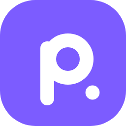

<p align="center"></p>

<h1 align="center">Própons IA</h1>

<p align="center">IA de estudos que roda no seu aparelho — Windows, Mac, Linux, Android e iPhone.<br>
Chat com histórico, código completo com cores, anexar arquivos e cálculo exato de algoritmos. Funciona offline.</p>

---

## Instalar

**Pelo celular ou PC, abra [muurxdev.github.io/propons-ia](https://muurxdev.github.io/propons-ia/)** — a página mostra o download certo para o seu aparelho.

| | |
|---|---|
| **Windows 10/11** | baixe **[Propons-IA-Windows.exe](https://github.com/muurxdev/propons-ia/releases/latest/download/Propons-IA-Windows.exe)** e abra — funciona direto do pendrive, sem instalar — [passo a passo](docs/instalar-windows.md) |
| **Mac (macOS 12+)** | baixe **[Propons-IA-Mac.zip](https://github.com/muurxdev/propons-ia/releases/latest/download/Propons-IA-Mac.zip)**, arraste para Aplicativos e abra com botão direito → Abrir — [passo a passo](docs/instalar-mac.md) |
| **Android 9+** | abra **[muurxdev.github.io/propons-ia/](https://muurxdev.github.io/propons-ia/)** no celular e toque em **Baixar para Android** (.zip → Extrair → instalar o .apk) — [passo a passo](docs/instalar-android.md) |
| **iPhone / iPad (iOS 16+)** | pelo **SideStore** ou **AltStore** — [passo a passo](docs/instalar-ios.md) |
| **Linux** | um comando (abaixo) ou `.deb` / `.rpm` — [passo a passo](docs/instalar-linux.md) |

### Linux — qualquer distribuição (um comando)
```bash
curl -fsSL https://raw.githubusercontent.com/muurxdev/propons-ia/main/linux/install.sh | bash
```
Ubuntu, Debian, Kali, Mint, Pop!_OS, Zorin, Fedora, Nobara, openSUSE, Arch, Manjaro, EndeavourOS… (x86_64 e ARM64).

<details><summary>Pelo gerenciador de pacotes</summary>

**Ubuntu, Debian, Kali, Mint, Pop!_OS, Zorin** (`.deb`)
```bash
wget https://github.com/muurxdev/propons-ia/releases/latest/download/propons-ia_amd64.deb
sudo apt install ./propons-ia_amd64.deb
```
**Fedora, Nobara, RHEL** (`.rpm`)
```bash
sudo dnf install https://github.com/muurxdev/propons-ia/releases/latest/download/propons-ia.x86_64.rpm
```
**openSUSE**
```bash
sudo zypper install https://github.com/muurxdev/propons-ia/releases/latest/download/propons-ia.x86_64.rpm
```
**Arch, Manjaro, EndeavourOS**
```bash
git clone https://github.com/muurxdev/propons-ia.git && cd propons-ia/linux && makepkg -si
```
ARM64: troque `amd64` por `arm64` (.deb) e `x86_64` por `aarch64` (.rpm).
</details>

<details><summary>Comandos no Linux</summary>

```bash
propons-ia                          # abre (ou pelo menu de aplicativos)
propons-ia --modelo avancado        # troca o modelo: leve | normal | avancado (fica salvo)
propons-ia --diagnostico            # confere sistema, bibliotecas e mede a velocidade
propons-ia --parar                  # desliga, se tiver ficado aberta
propons-ia --atualizar              # instala a versão mais nova
propons-ia --apagar-modelo avancado # apaga um modelo baixado
propons-ia --visao                  # liga a leitura de fotos
propons-ia --voz                    # liga a transcrição de áudio (x86_64)
propons-ia --gpu                    # usa a placa de vídeo (Vulkan); --sem-gpu volta ao processador
curl -fsSL https://raw.githubusercontent.com/muurxdev/propons-ia/main/linux/install.sh | bash -s -- --remover
```
Para abrir em janela própria, tenha Chrome, Chromium, Brave, Edge ou Vivaldi. Sem eles, abre no navegador padrão.
</details>

---

## O que ela faz

- **Chat** com histórico, busca, renomear, exportar (.md), editar e reenviar a pergunta, backup e importação
- **Código completo** quando você pede, com **cores** por linguagem, rótulo e botão copiar; botão **Continuar** se a resposta for cortada
- **Botão "+"**: câmera, fotos, arquivos (texto, código, **PDF e DOCX** — o texto é extraído no aparelho) e troca rápida de modelo
- **Lê as respostas em voz alta** com a voz do aparelho (botão em cada resposta; opção de ler toda resposta enquanto ela chega)
- **Fala vira texto**: 🎤 grava ou "+" → Áudio transcreve áudio de qualquer tamanho, no próprio aparelho (voz Base 57 MB ou Small 190 MB; no Linux: `propons-ia --voz`)
- **Biblioteca da sessão** ("+" → Biblioteca): fotos, arquivos e áudios transcritos que você mandou, para ver, usar de novo, copiar ou apagar; some ao fechar o app
- **Lê fotos e prints** (exercício, conta, gráfico, código) com o módulo de visão, baixado na primeira foto; no Linux: `propons-ia --visao`
- **Algoritmos** (bubble sort, selection sort, quick sort, busca binária com uma lista de números): passo a passo e resumo **calculados por código** — sempre corretos
- **Modelos de IA:** Própons Lume (leve e rápido) · Própons Aurora (médio, equilibrado) · Própons Ápice (pesado, o mais inteligente; 8 GB no PC, 12 GB no celular). Dá para baixar, usar, cancelar e apagar cada um, e o app mostra o recomendado para o aparelho
- **PC com placa de vídeo:** aceleração por GPU (Vulkan — NVIDIA, AMD ou Intel, sem instalar nada), ligada em Ajustes → Modelos de IA; a Própons mede processador × placa e só usa a placa se ela for mais rápida (3–4× numa placa dedicada)
- **Atualizações:** avisa quando sai versão nova e tem o botão **Atualizar tudo**. No Windows e no Android, o próprio app instala; no iPhone, pelo SideStore/AltStore; no Linux, com `propons-ia --atualizar`
- **Feita para o celular:** tela cheia, ajustes como um app, gestos (arrastar o histórico, segurar uma conversa), compartilhar respostas
- **Diagnóstico embutido:** memória, processador, espaço, velocidade real da IA e autoteste, com relatório para copiar
- **Estável e privada:** o motor religa sozinho se cair; histórico com backup; tudo roda no aparelho e só o próprio app acessa o motor

Na **primeira vez** em cada aparelho ela baixa o modelo (~0,5 / 1,2 / 2,7 GB) com retomada e verificação SHA-256; depois funciona **offline**.

---

## Como é feito

| Pasta | Conteúdo |
|---|---|
| `src/` | Interface única para todas as plataformas (`index.template.html` + módulos `app.js`, `plataforma.js`, `markdown.js`, `destaque.js`, `latex.js`, `detecta.js`, `algoritmos.js`, `resumo.js`), comportamento da IA (`conhecimento.md`) e testes |
| `app/` | Windows: programa C#/WebView2 e o empacotador do `.exe` único |
| `linux/` | Inicializador, `install.sh`, geração de `.deb/.rpm/.tar.gz`, `PKGBUILD`, testes em 10 distros |
| `android/` | App Kotlin (WebView + llama-server como processo), scripts de preparo, compilação e teste no emulador |
| `mac/` | App do Mac (Swift/AppKit + WKWebView + llama-server), montagem do .app e autoteste no CI |
| `ios/` | App SwiftUI (WKWebView + llama.cpp dentro do app via `llama.xcframework`), projeto XcodeGen e teste do motor |
| `.github/workflows/` | Compila todas as plataformas e publica a release ao criar uma tag `v*` |

Motor: [llama.cpp](https://github.com/ggml-org/llama.cpp) b11070 (MIT) · Modelos: [Qwen3.5](https://huggingface.co/unsloth) (Apache 2.0) · Windows: Microsoft WebView2.

<details><summary>Compilar localmente</summary>

```powershell
powershell -ExecutionPolicy Bypass -File build.ps1          # Windows → dist\Própons IA.exe
```
```bash
bash linux/build.sh                                          # Linux (Ubuntu com dpkg-dev e rpm) → dist/linux/
bash android/compilar.sh                                     # Android (JDK 17 + Android SDK) → dist/android/
bash ios/preparar.sh && cd ios && xcodegen generate          # iOS (macOS + Xcode)
node src/montar.js && node src/teste_algoritmos.js && node src/teste_markdown.js   # testes da interface
```
Para personalizar a IA, edite `src/conhecimento.md`.
</details>
